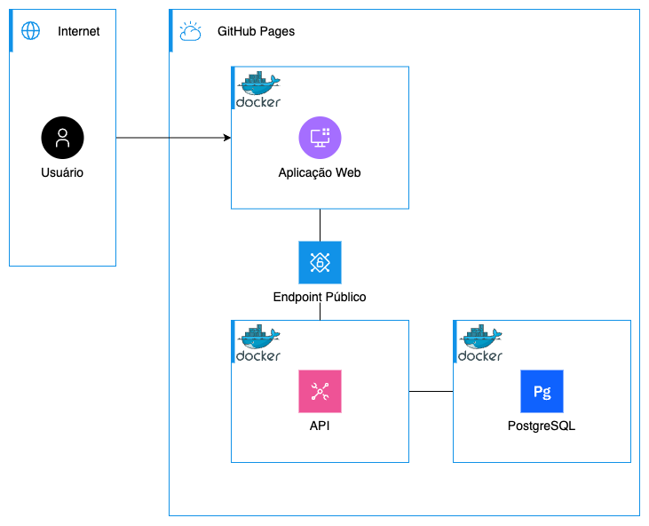
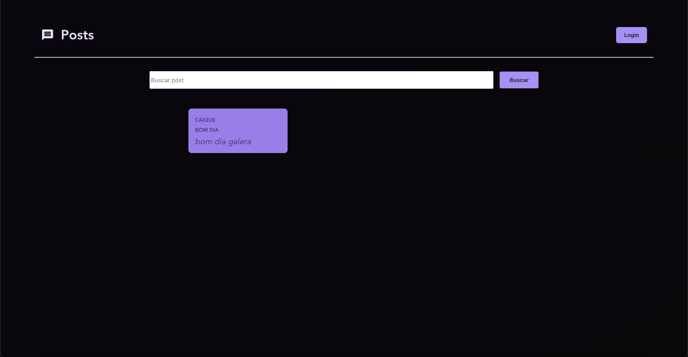
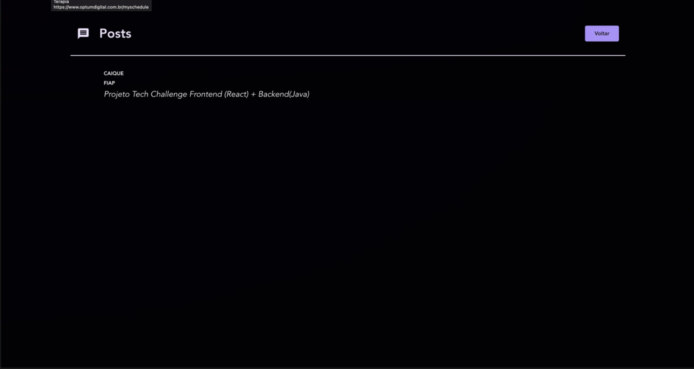
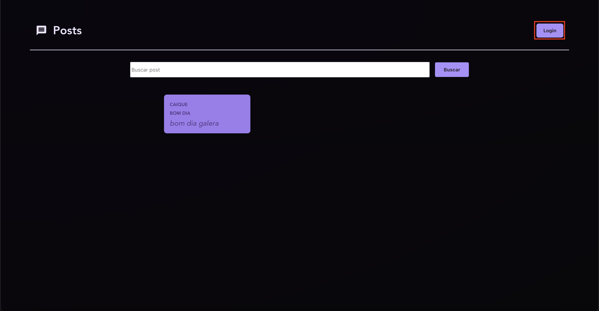
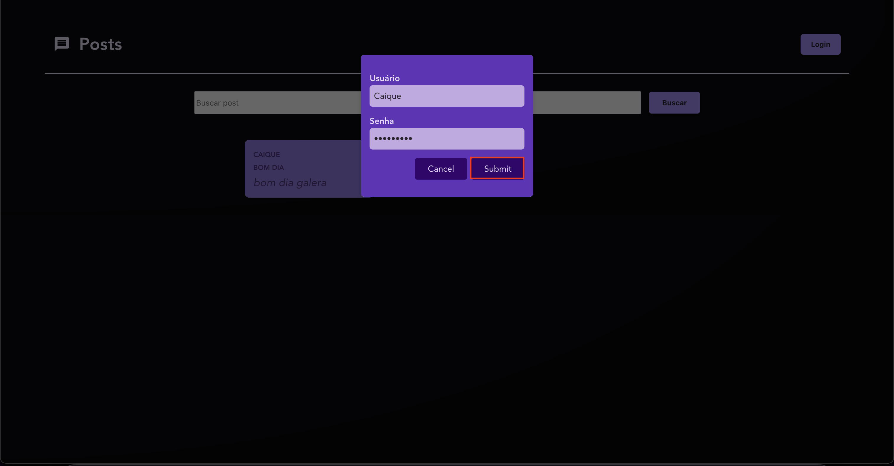
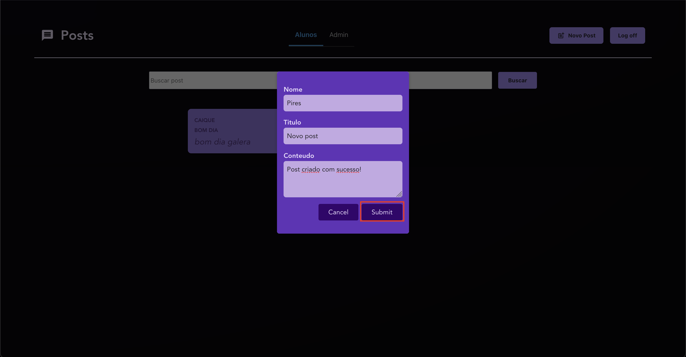
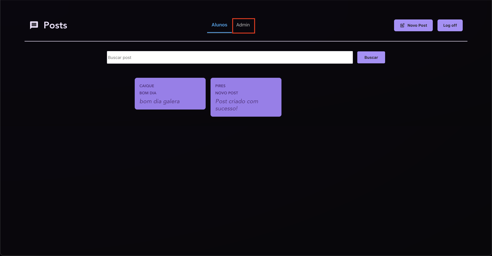
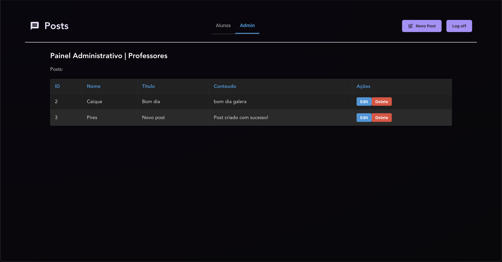
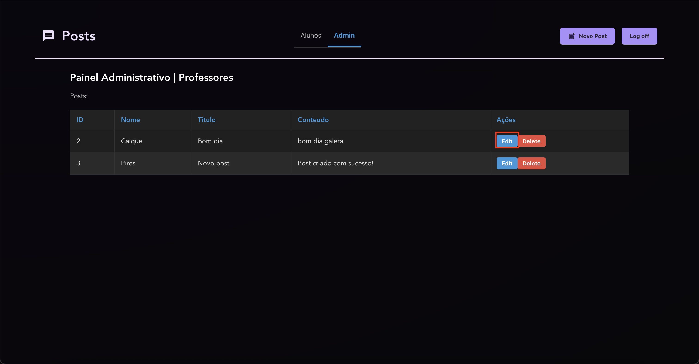
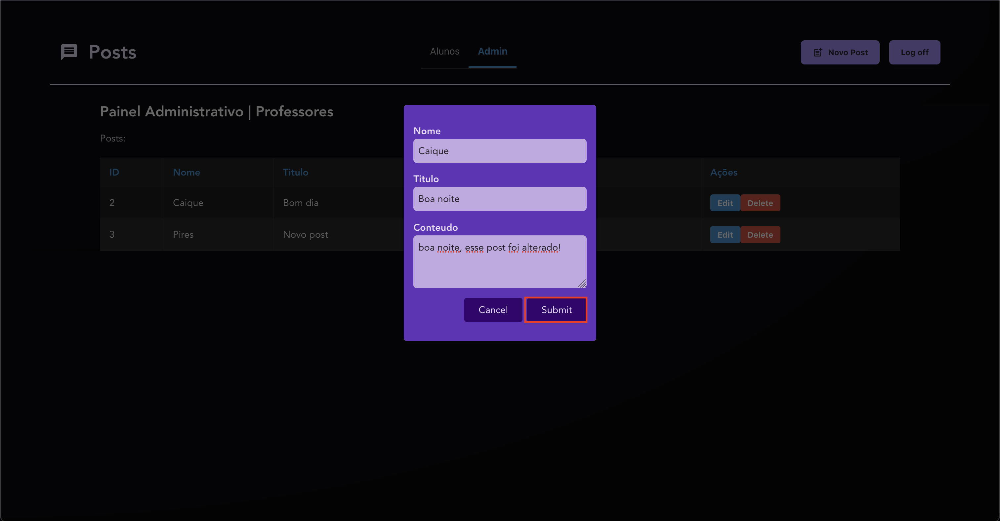

`<a id="readme-top"></a>`

<br />
<div align="center">
  <h1 align="center">TECH CHALLENGE - FASE 3 - 4FSDT
 </h1>
  <br />
</div>
<details>
  <summary>Conteúdo da Documentação</summary>
  <ol>
    <li>
      <a href="#sobre-o-projeto">Sobre o projeto</a>
      <ul>
        <li><a href="#built-with">Built With</a></li>
      </ul>
    </li>
    <li><a href="#arquitetura">Arquitetura</a></li>
    <li>
      <a href="#como-comecar">Como Começar</a>
      <ul>
        <li><a href="#pre-requesitos">Pre-requesitos</a></li>
        <li><a href="#instalacao">Instalação</a></li>
      </ul>
    </li>
    <li><a href="#desenvolvedores">Desenvolvedores</a></li>
  </ol>
</details>

## Sobre o projeto

### Desafio:

Atualmente, a maioria de professores e professoras da rede pública de
educação não têm plataformas onde postar suas aulas e transmitir conhecimento
para alunos e alunas de forma prática, centralizada e tecnológica.

### Solução

A solução proposta consiste em uma plataforma para gestão de postagens educacionais, com a implementação de uma interface gráfica para criação, edição, exclusão e busca de conteúdo, integrada à um serviço que efetuará a persistências das alterações, assim como o resgate dos dados. O front-end é desenvolvido utilizando o framework ReactJS, permitindo a criação de telas dinâmicas e responsivas, utilizando a sintaxe de HTML e JavaScript combinadas. A aplicação é containerizada com Docker, garantindo consistência entre os ambientes de desenvolvimento e produção. A automação de testes e deploy é realizada com GitHub Actions. A plataforma permite uma gestão eficiente e controlada do conteúdo educacional para professores, com acesso fácil para alunos.

<p align="right">(<a href="#readme-top">back to top</a>)</p>

### Built With

-   [ReactJS](https://react.dev/)
-   [React Hooks](https://react.dev/reference/react/hooks)

<p align="right">(<a href="#readme-top">back to top</a>)</p>

## Arquitetura

<div align="center">
<<<<<<< Updated upstream
  
</div>

## Como Começar

=======


</div>

## Como Comecar

> > > > > > > Stashed changes

Este é um exemplo de como você pode dar instruções sobre como configurar seu projeto localmente.
Para obter uma cópia local instalada e funcionando, siga estas etapas simples de exemplo.

## Pré-requesitos

-   NodeJS
-   Docker
-   Git

# <<<<<<< Updated upstream

## Guia de telas

Inicialmente temos a tela de Login



Nela podemos visualizar todos os posts incluídos no blog.

Também é possível vizualizar melhor as informações sobre um post específico. Para isso, basta clicar no cartão do post desejado.



A partir dessa tela podemos tambem fazer login como professor.



É preciso preencher o modal que aparece na tela, com o usuário e senha do professor.



Com a autenticação efetuada, temos permissão para acessar novas telas. Vamos ver a de criação de posts.


Aqui temos um modal para criar um novo post, precisamos fornecer o nome do autor, um título e o conteúdo para esse post. Após isso, basta clicar em submeter.



Com o login efetuado, também podemos acessar a página de Administração. Podemos clicar na aba "Admin" para acessar essa tela.



Na tela de administração, são listados todos os posts em forma de tabela. Cada registro possuí os dados cadastrados, juntamente com dois botões.



O primeiro botão, é um botão para editar o post. Clicando nele, podemos alterar todas as informações cadastradas para aquele post.



Ao clicar, um modal é aberto, exibindo os dados do post. Podemos então, alterar todos eles e submeter a edição.



O segundo botão, é um botão para deletar o post. Clicando nele, podemos deletar o post desejado, para que não esteja mais disponível.


> > > > > > > Stashed changes

## Instalação

1. Clone o repositório

    ```sh
    git clone https://github.com/Pirdo/tech-challenge-front
    ```

2. Instale as dependencias

    ```sh
    npm install
    ```

3. Crie um arquivo .env com as variáveis preenchidas listadas em [.env-example](.env.example).
4. Rode a aplicação

    ```bash
    npm start
    ```

<p align="right">(<a href="#readme-top">back to top</a>)</p>

## Desenvolvedores

| Name                          | RM                  |
| ----------------------------- | ------------------- |
| <h3>Gabriel Pires </h3>       | <h3> RM360472 </h3> |
| <h3>Caique Dutra Santos </h3> | <h3> RM360210 </h3> |
